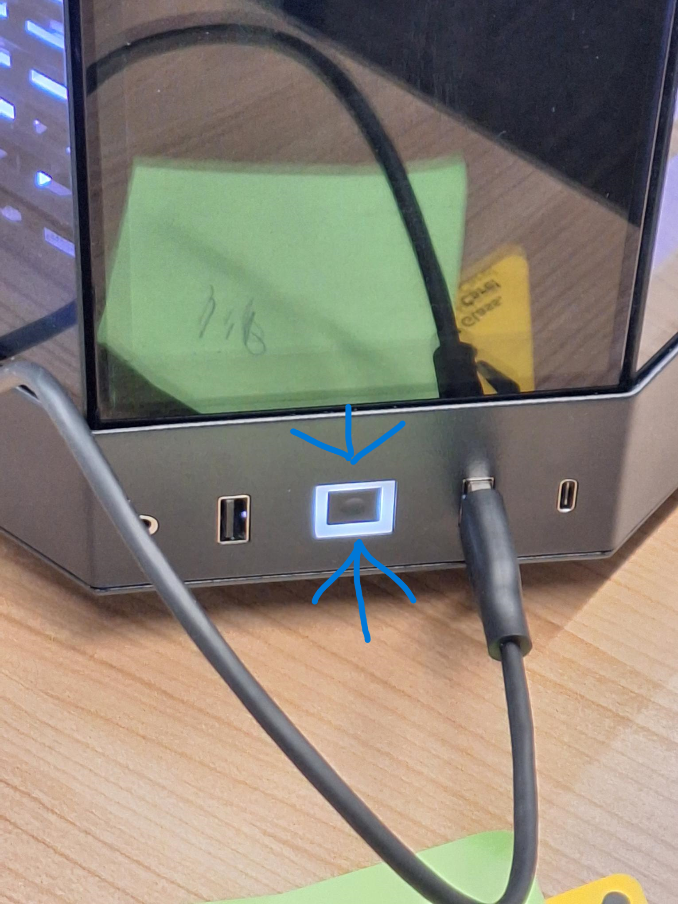
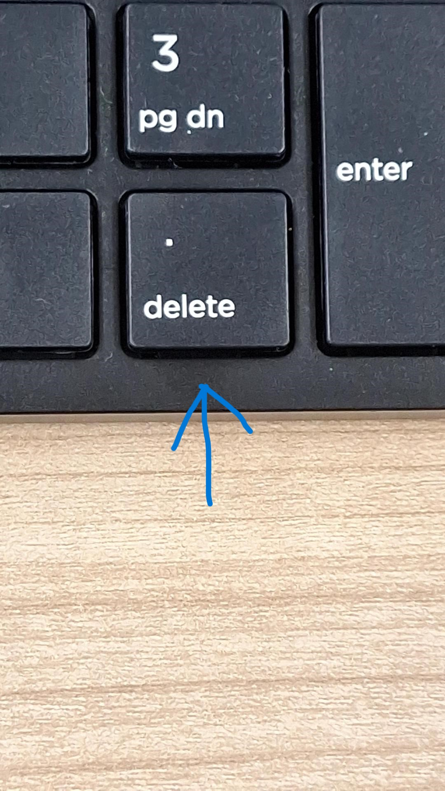
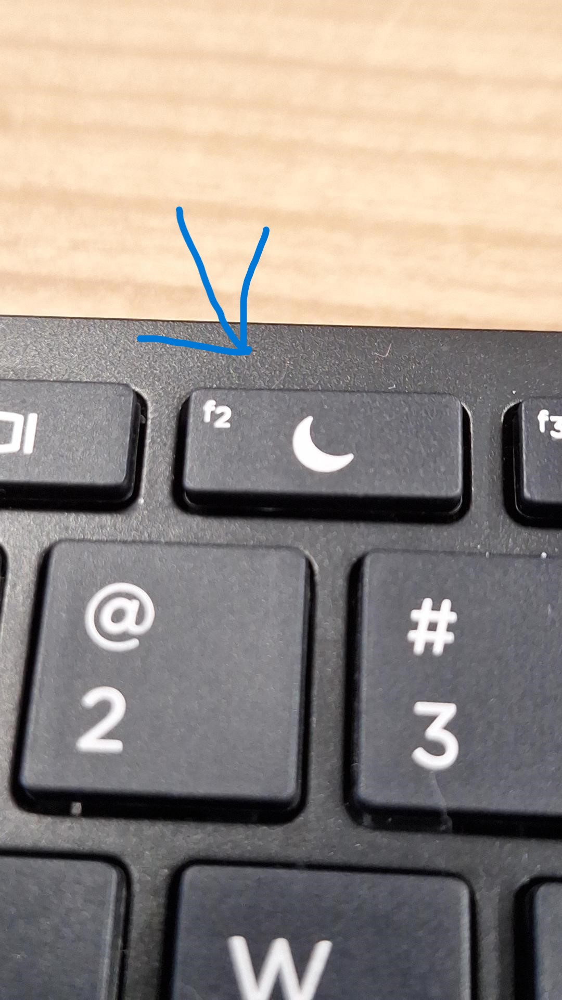

# Hoe-gebruik-je-Hard-drives

Hier word uitgelegd hoe je harde schijven / Hard drives aanmaakt en login gegevens regelt.

  

## Inleiding 

 

### Wat is een image?

 

Een harde schijf / hard drive kan verschillende Besturingssystemen na doen zoals Windows/Mac/Linux, dit is wat je een "image" noemt.

 

### Waarom images op hard drives maken?

Met behulp van images kan je zoals je gelezen hebt een Besturingssystemen na doen zoals Windows/Mac/Linux.

### Reden 1:

Dit is handig omdat je met harde schijven / hard drives jouw werk kan bewaren apart van de computers eigen bestanden.

als er problemen ontstaan door bepaalde bestanden op programma's zijn ze nu geïsoleerd op jouw drive op deze manier kunnen anderen mensen zonder problem veder werken op de computer. 

### Reden 2:

Een computer heeft een limiet op hoeveel data bewaart kan in de opslag.

Met harde schijven / hard drives heeft iedereen ongeveer 1 terabyte apart van de computer opslag,

maar het is altijd mogelijk om beteren hard drives te kopen met meer opslag.

          

## De status van harde schijven. 

### De schijven die in bezit zijn hebben stickers met namen, maar er zijn wel 1 exceptie.
- De studenten schijf "Stu01" zit in de kast in de ruimte van de computers Jip en Janneke.

- ### sticker namen
    - Schijf 1: Sven
    - schijf 2: Laris
    - schijf 3: Schep
    - schijf 4: Mart
    - schijf 5: Rob
    - schijf 6: stu01 (op locatie in de kast)
    - schijf 7: (not taken)
    - schijf 8: (not taken)
    - schijf 9: (not taken)
    - schijf 10: (not taken)
    - Mark's eigen schijf: Mark

Er zijn dus 4 schijven nog beschikbaar voor mensen die willen werken in het Data-lab deze zijn nog niet geprogrammeerd met een windows image.

Er is wel hoe ever zoals eerder aangegeven een drive al aangemaakt voor studenten E-mail deze persoon om het wachtwoord aan te vragen: WilMJ@hr.nl

                   

## Hoofdstuk 1 basis: Hoe maak je een Image?

  

          

## Hoofdstuk 2 basis: Hoe start ik computer Jip/Janneke

  

Als eerst gaan wij kijken naar de achterkant van de computer zie plaatje als voorbeeld.

    

Je ziet dat er links onderaan op de achterkant een schakelaar staat, maak zeker dat de schakelaar zoals op het plaatje aan staat je kan dat zien als streepjes kant omlaag en de bolletjes kant omhoog.

    

Nu staat de computer aan maar is hij nog niet opgestart.

Het volgende wat je wilt doen is bij elke monitor rechts onder achteraan op de knop drukken (druk in het midden van de knop) dit zet de monitoren aan 

    

Als het goed is staan je monitoren aan maar kan je het nog niet zien, wat je nu moet onthouden is dat bij het opstarten van de computer zal het meest rechtse monitor de werkende monitor zijn tot dat je bent ingelogd.

    

Nu dat de schermen aan staan en je de context weet kan je de computer nu helemaal aan zetten door deze knop een keer in te drukken.

          

## Hoofdstuk 3 basis: Een drive voor de eerste keer op starten

  

Zorg dat de harde schijf / hard drive via een:
  
usb + usb-c kabel,
   
of usb-c + usb-c kabel,
   
verbonden is aan de computer en de harde schijf / hard drive.

    

Vervolgens kan je de computer aan zetten, 

   
terwijl die opstart blijf je drukken op Delete / F2 tot een scherm op komt,

  
   
hou dan Delete / F2 ingedrukt tot dat het scherm weg gaat.

  

Wanneer een scherm weer zichtbaar is klik rechtsboven op "boot".

     

### BELANGRIJK: Als je dit niet doet moet jouw schijf data overschreven worden.

 

Voordat je de computer afsluit ga naar settings met Windows + I.

Ga dan naar "Accounts" en dan onder "login opties" / "sign in options" klik op "voeg een nieuw wachtwoord" / "add a new password".

Vervolgens voer in jouw nieuwe wachtwoord twee keer en een geheugen steuntje ga dan rechts onder veder tot het proces klaar is.

Nu kan je veilig afsluiten zonder het probleem dat je niet meer kan inloggen.

          

## Hoofdstuk 4 basis: Hoe start je weer een Hard drive op

  

Zorg dat de harde schijf / hard drive via een:
  
usb + usb-c kabel,
   
of usb-c + usb-c kabel,
   
verbonden is aan de computer en de harde schijf / hard drive.

  

Vervolgens kan je de computer aan zetten, 
   
terwijl die opstart blijf je drukken op Delete / F2 tot een scherm op komt,
   
hou dan Delete / F2 ingedrukt tot dat het scherm weg gaat.

  

Wanner een scherm weer zichtbaar is klik rechtsboven op "boot".
   
Daarna scroll omlaag tot jij jouw drive versie ziet en klik op die naam.
   
(Jouw schijf / drive naam is waarschijnlijk: Samsung T7)

  

Ver volgens vraagt het systeem om jouw wachtwoord die je de eerste keer gemaakt hebt.

Vul dat in en je zit op je drive te werken.

  

### Nog niet gedaan? lees dan het stukje: 

[BELANGRIJK: Als je dit niet doet moet jouw schijf data overschreven worden](#belangrijk-als-je-dit-niet-doet-moet-jouw-schijf-data-overschreven-worden)

  

### Wachtwoord vergeten? 

Als het goed is kan je jouw geheugen steuntje bekijken die je ingevoerd had samen met je wachtwoord de eerste keer.

Als je dan nog steeds niet kan inloggen moet je helaas de harde schijf overschrijven met de mogelijkheid om sommige bestanden over te zetten.

Dit doe je door de schijf via kabel te verbinden aan een computer/laptop die je normaal opstart.

Zodra dat gedaan is kan jij jouw "file explorer" openen en de drive opzoeken en double klikken onder de "this PC" folder.

Nu kan je doorzoeken welke bestanden jij wilt over zetten van jouw drive op de computer/laptop.

          